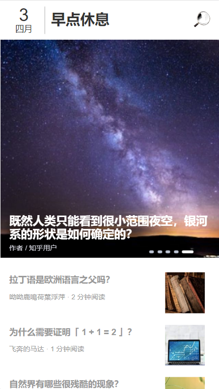

## 地址

* 前端:https://github.com/superBiuBiuMan/-zhuhu_daily
* 后端:https://github.com/superBiuBiuMan/zhihu-daily-admin
* 学习地址:Bilibili
  * https://www.bilibili.com/video/BV1wx4y157Gu

## 介绍

* 技术栈使用React18 + React-redux + redux/toolkit + craco(重写配置) + ( amfe-flexible + postcss-pxtorem 达到适配 ) + less

* `keep-alive`效果没实现,找了几个库效果都不理想,就没去弄了

## 运行

### 前端运行

* 1.安装依赖(node什么的自行安装)

```
yarn install
```

* 2.运行

```
npm run start
```

### 后端运行

* 1.安装依赖(node什么的自行安装)

```
yarn install
或者
npm install
```

* 2.运行

```
node server.js
```

## 图片展示

### 首页

|  |  |
| -------------------------------------- | -------------------------------------- |

### 详情页面


### 个人中心页


### 修改个人信息页


### 收藏页


### 加载骨架屏

